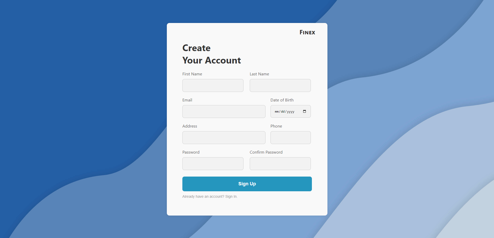
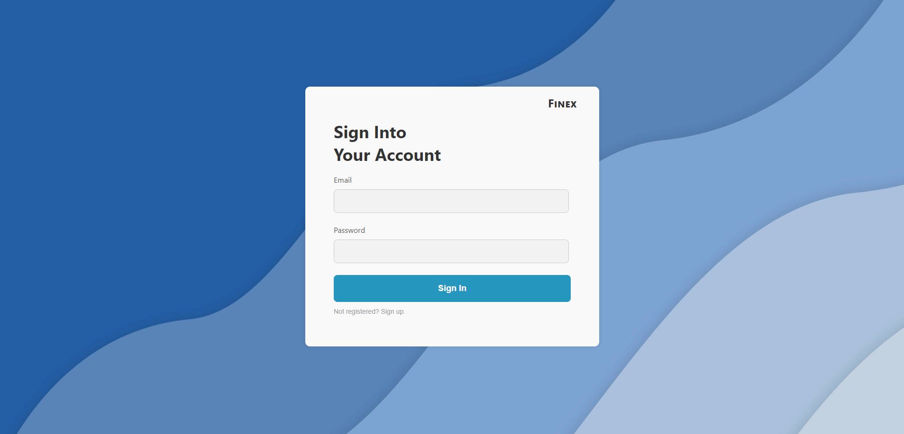

# Finex - Online Banking Platform

Welcome to Finex, a project designed to emulate the functionality of a banking platform, built for practicing and improving my development skills. The system manages users, transactions, and accounts with an intuitive and seamless interface. 

Written in TypeScript, Express.js, and React, this application exhibits how we can design a full-fledged banking application. Even though this project isn't intended for commercial use, I've incorporated best practices regarding security and data handling, comparable to real-world banking systems. 

 

## Key Features

- **User Authentication & Authorization**: User Authentication and Authorization are handled using JWT (JSON Web Tokens). Passwords are hashed securely using bcrypt, ensuring user credentials are stored safely.

- **MongoDB and Mongoose**: MongoDB, a NoSQL database, is used for managing the application's data. Mongoose is leveraged to model the application data effectively.

- **Transaction Management**: Finex simulates a real-world banking system with a transaction schema that keeps track of vital transaction details like the source and destination accounts, transaction amount, timestamp, and transaction status.

- **Account Management**: The platform handles account details and maintains information like the account number, account name, balance, account type, and account status.

## Project Structure

Here's a quick run-through of the core structure of the project:

- `app.ts`: The entry point of the backend server. It sets up the middleware, database connection, and route handling.

- `userRoutes.ts`: This file is responsible for managing user-related HTTP requests and routing them to the correct controller functions.

- `accountRoutes.ts`: Handles all the account-related routes like creating, fetching, updating, and deleting an account.

- `transactionRoutes.ts`: Manages the routes related to transactions including creating, fetching, updating, and deleting transactions.

- `User.ts`: This defines the user schema and model. It handles password hashing before saving it to the database and provides a function for password comparison during user authentication.

- `Account.ts`: Defines the account schema and model, storing information like account holder's user ID, account number, name, balance, type, and status.

- `Transaction.ts`: This file defines the transaction schema and model, recording details like the source and destination account IDs, transaction amount, timestamp, and status.

- `userController.ts`: Contains the handler functions for user-related routes. Functions for user login, user registration, fetching all users, fetching a single user by ID, updating a user's data, and deleting a user are defined here.

- `accountController.ts`: This manages the functions related to accounts. This includes creating an account, fetching all accounts, fetching a single account by ID, updating account details, and deleting an account.

- `transactionController.ts`: Contains the handler functions for transaction-related routes. This includes functions for creating a transaction, fetching all transactions, fetching a single transaction by ID, updating a transaction, and deleting a transaction.

